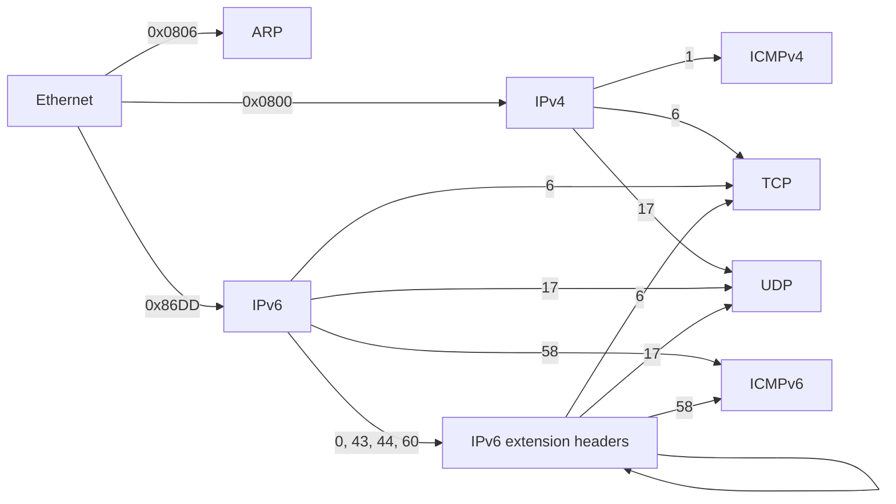

# How NETProtocols works

This is a guided tour of the library's inner workings, written for
anyone who wants to contribute a protocol, fix a bug, or simply
understand how raw bytes become Python objects and back. No prior
experience with packet dissection is assumed — only curiosity and a
little Python.

## A header is just bytes at fixed positions

Here are the first 14 bytes of a real captured frame — an Ethernet II
header announcing an ARP packet:

```
ff ff ff ff ff ff   00 07 0d af f4 54   08 06
└───────────────┘   └───────────────┘   └───┘
 destination MAC       source MAC     EtherType
   (broadcast)                        0x0806 = ARP
```

Every protocol header works like this: a sequence of fields, each at a
known offset with a known width, in network byte order (big-endian).
Parsing one is nothing more than slicing the right bytes and
interpreting them as integers or addresses.

## From bytes to a dataclass

Each protocol is a **frozen, slotted dataclass** whose fields mirror
the wire format, plus a class-level `struct.Struct` describing the
fixed portion's layout. For the header above:

```python
@dataclass(frozen=True, slots=True)
class Ethernet(Protocol):
    dst: str        # "ff:ff:ff:ff:ff:ff"
    src: str        # "00:07:0d:af:f4:54"
    ethertype: int  # 0x0806

    _struct: ClassVar[Struct] = Struct("!6s6sH")
```

The format string `"!6s6sH"` reads: network byte order (`!`), two
6-byte strings (the MACs), one unsigned 16-bit integer (the
EtherType). The `Struct` is compiled once at class definition time —
decoding a million frames reuses the same compiled object.

Three design choices worth knowing:

- **Frozen + slots**: instances are immutable (safe to share, hash,
  and compare) and carry no `__dict__` (cheap to allocate by the
  million during live capture).
- **Friendly field types**: addresses are stored as their canonical
  strings, everything else as `int`, options as `bytes`. What you see
  in a `repr()` is what you work with.
- **Bitfields are explicit**: where the wire packs several fields into
  one integer (IPv4's version/IHL byte, TCP's offset/flags word), the
  decode method splits them with shifts and masks you can read:

  ```python
  ihl = ver_ihl & 0x0F
  version = ver_ihl >> 4
  ```

## The decode contract

`decode(data)` is the heart of the library, and every protocol obeys
the same three rules (spelled out in [`_base.py`](src/netprotocols/_base.py)):

1. **It receives the entire remaining buffer** — everything from the
   start of its header to the end of the captured frame — and parses
   the fixed portion with `_struct.unpack_from`. A buffer too short
   for the fixed portion raises `TruncatedHeaderError`.
2. **Variable-length headers finish the job themselves.** IPv4 reads
   its IHL and TCP reads its data offset, sanity-checks it (5–15, and
   the declared bytes must exist in the buffer — a header that *lies*
   about its length raises `TruncatedHeaderError`), then slices its
   `options` as materialized `bytes`.
3. **Trailing bytes are fine.** Whatever follows the header belongs to
   the next layer. After decoding, `instance.header_len` says exactly
   how many bytes this header consumed — a *property*, so IPv4 answers
   `ihl * 4` and TCP answers `data_offset * 4`.

Decoding accepts `bytes` or `memoryview`. Views are a decode-time
transient only: every stored field is a scalar or materialized
`bytes`, so no decoded object ever aliases the buffer it came from.
You can safely reuse or mutate capture buffers.

Errors form a small typed hierarchy rooted at `ProtocolError`:

```
ProtocolError
├── TruncatedHeaderError     buffer shorter than the header claims
└── InvalidFieldError        field value violates the protocol's rules
    ├── InvalidMACAddressError
    ├── InvalidIPv4AddressError
    └── InvalidManufacturerCodeError
```

## Walking a frame: the next_protocol() chain

A captured frame is a chain of headers, each one naming what it
carries. In this library that fact is typed: every decoded header
answers `next_protocol()` with the *class* that decodes its payload,
or `None` when the chain ends (nothing encapsulated, or a protocol
this library doesn't implement yet).



IPv6 extension headers (Hop-by-Hop Options, Routing, Fragment,
Destination Options) chain like any other protocol — each names what
follows via `next_header` — and may stack. Two guardrails: the
registry hands them out only inside an IPv6 chain (a garbage IPv4
packet with `protocol=0` cannot conjure a Hop-by-Hop layer), and a
Fragment header chains onward only when `fragment_offset == 0` — a
non-first fragment carries a slice from the middle of the original
payload, so no upper-layer header exists at its start. The same
offset rule applies to fragmented IPv4.

The numbers on the arrows are the wire values — EtherTypes out of
Ethernet, IP protocol numbers out of IPv4/IPv6 — and they live in
[`_enums.py`](src/netprotocols/_enums.py) as `EtherType` and
`IPProtocol`. IPv4 and IPv6 share one registry because the number
space is shared (1 is ICMPv4, 58 is ICMPv6, 6 is TCP, 17 is UDP — no
collisions).

A complete frame walk is a five-line loop:

```python
layers, cursor, protocol = [], 0, Ethernet
while protocol is not None:
    header = protocol.decode(frame[cursor:])
    layers.append(header)
    cursor += header.header_len
    protocol = header.next_protocol()
```

**Why the deferred imports?** `Ethernet.next_protocol()` must name
`ARP`, `IPv4`, and `IPv6` — but `arp.py` also imports from the
Ethernet side of the world (EtherType names). Importing layer modules
from each other at module level would create cycles, so two rules keep
the graph acyclic: shared registries live in the dependency-free
`_enums.py`, and `next_protocol()` mappings import their target
classes *inside the function body*, at call time.

## Port-based dispatch is best-effort

The EtherType and IP-protocol registries dispatch on a single
authoritative field. Application protocols break that model: they are
identified by *port*, which is a heuristic — any service may run on any
port, and the discriminator is split across the source and destination
ports. `UDP.next_protocol()` therefore consults a well-known-port
registry (`netprotocols.layer4._ports`), checking the destination port
first (a request targets the server's port) and then the source port
(a response comes from it). `DNS` is the first such protocol; a DNS
message on UDP port 53 now decodes as a fourth layer.

Because the guess can be wrong, the application class validates
strictly on decode: a non-DNS datagram that happens to use port 53
raises a `ProtocolError`, which the ordinary decode-error path absorbs
(the chain keeps the layers it did decode and records the failure). So
a mis-dispatch degrades to a diagnosed frame, never to garbage. Only
UDP is wired this way for now — DNS over TCP carries a 2-byte length
prefix (RFC 1035 §4.2.2) that needs separate handling.

## The encode side, and the round-trip guarantee

Every class also works in reverse. Constructors take the friendly
forms (string addresses, integer fields), validate them in
`__post_init__` (address formats; and IHL/data-offset must agree with
`len(options)` — you cannot construct a self-contradictory header),
and `bytes()` re-emits the exact on-wire form.

The test suite enforces the round trip in both directions for every
protocol:

```python
Protocol.decode(bytes(header)) == header        # object → wire → object
bytes(Protocol.decode(raw)) == raw[:header_len] # wire → object → wire
```

One deliberate boundary: **decode and encode carry checksums
verbatim** — exactly what you want when faithfully re-encoding
captured traffic. Computing and verifying them is explicit, via
`netprotocols.checksum`: `compute()`/`verify()` handle the IPv4 header
checksum, ICMPv4, and TCP/UDP/ICMPv6 with their IPv4/IPv6
pseudo-headers, and `Packet.with_checksums(payload)` fills a whole
stack before sending. (The RFC 768 subtlety lives where it belongs:
the `0x0000 → 0xFFFF` substitution applies to UDP alone.)

`Packet` is the thin composition layer: it holds an ordered tuple of
headers and `bytes(packet)` joins them, ready for a raw socket.

## Layout map

```
src/netprotocols/
├── __init__.py     public API re-exports, __version__
├── _base.py        Protocol ABC, decode contract, address helpers
├── _enums.py       EtherType, IPProtocol, ARPOperation (imports nothing)
├── packet.py       Packet composition, with_checksums()
├── checksum.py     RFC 1071: internet_checksum, compute, verify
├── layer2/         ethernet.py, arp.py
├── layer3/         ip.py (IPv4 + IPv6), icmp.py (ICMPv4 + ICMPv6),
│                   igmp.py,
│                   ipv6_ext.py (Hop-by-Hop, Routing, Fragment,
│                   Destination Options)
├── layer4/         tcp.py, udp.py, _ports.py (well-known-port registry)
├── layer7/         dns.py
└── utils/          validators (mac.py, ipv4.py), exceptions.py
tests/              one file per protocol + test_contract.py
                    (truncation, lying lengths, chain walks),
                    test_corpus.py (invariants over the real-capture
                    corpus in tests/fixtures/, 65 frames across 12
                    scenarios — see its MANIFEST.md), test_checksum.py
                    (corpus checksums recompute to wire values), and
                    test_fuzz.py (hypothesis properties: decode never
                    raises outside ProtocolError)
```

Tooling: [uv](https://docs.astral.sh/uv/) manages the environment
(`uv sync`); `uv run pytest`, `uv run mypy` (strict), and
`uv run ruff check` are the three gates CI enforces on Python
3.12–3.14.

## Cookbook: adding a protocol

Say you want to add DNS (sitting behind UDP). The pattern is always
the same:

1. **Model the fixed header.** Create `layer7/dns.py` with a frozen,
   slotted dataclass: one field per header field, a `_struct` for the
   fixed portion (`"!HHHHHH"` for DNS: id, flags, and four counts).
2. **Implement `decode()`.** Call `cls._unpack_fixed(data)`, split any
   bitfields explicitly, and construct the instance. If the header is
   variable-length, validate the declared length against `len(data)`
   (raise `TruncatedHeaderError` when the buffer can't satisfy it) and
   materialize the variable part as `bytes`.
3. **Implement `__bytes__()`.** Pack the same fields back; the
   round-trip tests will hold you honest. When a payload is
   self-referential — DNS names compress by pointing at earlier bytes,
   so re-encoding a parsed record cannot reproduce the original — keep
   that region as raw `bytes` and parse it through read-only accessors
   that never re-encode. `bytes(decode(x)) == x` then holds by
   construction (see `layer7/dns.py`).
4. **Wire the chain.** The layer below decides when your class is
   next. For DNS that means UDP would implement `next_protocol()`
   consulting the ports. (For a new EtherType or IP protocol number,
   add the value to `_enums.py` — display name in lockstep, a test
   enforces it — and one mapping entry in `ethernet.py`/`ip.py`, using
   a deferred import. Numbers valid only inside an IPv6 chain follow
   the extension headers' example: `_ip_protocol_class` hands them out
   only when `ipv6=True`.)
5. **Add display properties** for anything a human would want rendered
   (`flags_str`-style names, hex strings). Degrade gracefully on
   unknown values — return `"unknown (47)"`, never raise from a
   display helper.
6. **Test with real bytes.** Capture or craft a real header, add it as
   a fixture, and cover: a decode with asserted fields, both round
   trips, truncated input, and (if variable-length) an options case
   and a lying-length case. Export the class from `__init__.py`.

If you follow the six steps, your protocol automatically composes with
`Packet`, participates in frame walks, and inherits the library's
error behavior — that's the whole point of the shared contract.
