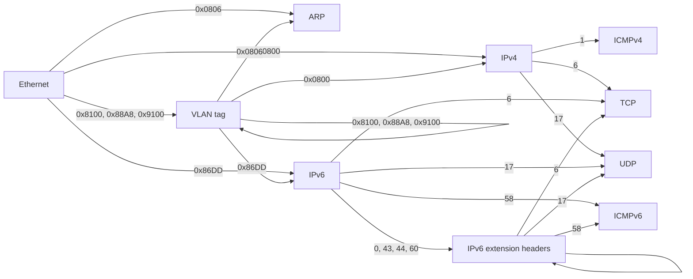

# How NETProtocols works

This is a guided tour of the library's inner workings, written for
anyone who wants to contribute a protocol, fix a bug, or simply
understand how raw bytes become Python objects and back. No prior
experience with packet dissection is assumed — only curiosity and a
little Python.

## A header is just bytes at fixed positions

Here are the first 14 bytes of a real captured frame — an Ethernet II
header announcing an ARP packet:

```
ff ff ff ff ff ff   00 07 0d af f4 54   08 06
└───────────────┘   └───────────────┘   └───┘
 destination MAC       source MAC     EtherType
   (broadcast)                        0x0806 = ARP
```

Every protocol header works like this: a sequence of fields, each at a
known offset with a known width, in network byte order (big-endian).
Parsing one is nothing more than slicing the right bytes and
interpreting them as integers or addresses.

## From bytes to a dataclass

Each protocol is a **frozen, slotted dataclass** whose fields mirror
the wire format, plus a class-level `struct.Struct` describing the
fixed portion's layout. For the header above:

```python
@dataclass(frozen=True, slots=True)
class Ethernet(Protocol):
    dst: str        # "ff:ff:ff:ff:ff:ff"
    src: str        # "00:07:0d:af:f4:54"
    ethertype: int  # 0x0806

    _struct: ClassVar[Struct] = Struct("!6s6sH")
```

The format string `"!6s6sH"` reads: network byte order (`!`), two
6-byte strings (the MACs), one unsigned 16-bit integer (the
EtherType). The `Struct` is compiled once at class definition time —
decoding a million frames reuses the same compiled object.

Three design choices worth knowing:

- **Frozen + slots**: instances are immutable (safe to share, hash,
  and compare) and carry no `__dict__` (cheap to allocate by the
  million during live capture).
- **Friendly field types**: addresses are stored as their canonical
  strings, everything else as `int`, options as `bytes`. What you see
  in a `repr()` is what you work with.
- **Bitfields are explicit**: where the wire packs several fields into
  one integer (IPv4's version/IHL byte, TCP's offset/flags word), the
  decode method splits them with shifts and masks you can read:

  ```python
  ihl = ver_ihl & 0x0F
  version = ver_ihl >> 4
  ```

## Structural pattern matching

Every decoded header works with `match`/`case` today, and nothing in
`src/` was written to make that true — it falls out of the two design
choices above, for reasons worth being precise about:

```python
match eth:
    case Ethernet(ethertype=EtherType.IPV4):
        ...

match ip:
    case IPv4(protocol=IPProtocol.TCP, ttl=t) if t > 32:
        ...
```

1. **`@dataclass` auto-generates `__match_args__`** from the field
   declaration order — `Ethernet.__match_args__ ==
   ('dst', 'src', 'ethertype')` — so a *positional* class pattern
   (`case Ethernet(dst, src, ethertype)`) works with no extra code. An
   ordinary class has to declare `__match_args__` by hand to get that.
   Most headers here never do either — but a few of the widest ones
   are a deliberate exception: `IPv4`, `TCP` and `DHCP` run to 14, 11
   and 15 fields respectively, so their full auto-generated tuple is
   unusable positionally (nobody writes, or gets right, a
   fourteen-slot pattern). Those three hand-declare a short
   `__match_args__` instead — `IPv4.__match_args__ ==
   ('src', 'dst', 'protocol')` — the two or three fields someone
   drafting a positional pattern actually reaches for. The override is
   documented at each class and pinned by
   `tests/test_pattern_matching.py`, so it cannot drift the way an
   *accidental* override would; keyword patterns
   (`case IPv4(protocol=6)`) are unaffected by any of this and stay
   the documented default (#94).
2. **Every field with a fixed vocabulary of wire values is an
   `IntEnum`**, defined in [`_enums.py`](src/netprotocols/_enums.py),
   and `IntEnum` subclasses `int`. A *value* pattern therefore matches
   the plain integer the wire actually carries —
   `case Ethernet(ethertype=EtherType.IPV4)` matches an instance whose
   `ethertype` field holds the `int` `0x0800` — with no cast, no
   adapter, and no separate "typed" view to keep in sync with the raw
   field.

Keyword class patterns (`ClassName(field=pattern)`) work on *any*
object exposing that attribute; `__match_args__` is only needed for
the positional form. What a frozen dataclass adds is that the
attribute is guaranteed to exist exactly as declared, with no
proxying: a class pattern here either matches a real field or fails
outright — a mistyped field name in a keyword pattern silently never
matches rather than raising, on any object, dataclass or not, so this
buys reliability rather than a new failure mode, not immunity from
that one. (How this compares to other Python packet libraries is
tracked in `docs/CLAIMS.md`, not stated here — see the embargo notes
there.)

**Keeping this working is a contributor obligation, not a given.**
Field declaration order is part of a class's public API — reordering
fields changes what a positional pattern binds to, silently, for
anyone matching by position. (The curated three are the exception:
`IPv4`/`TCP`/`DHCP`'s hand-declared `__match_args__` is independent of
field order, so reordering *their* fields cannot break positional
matching — but adding or renaming one of the fields the curated tuple
names does need the tuple, and the test pinning it, updated by hand.)
And a field carrying a closed set of wire values should stay an
`IntEnum` sourced from `_enums.py` rather than degrade to a bare
`int`; the moment it does, `case Header(field=SomeEnum.X)` stops
matching and fails silently (the pattern falls through to the next
`case`, it does not raise) rather than loudly.

## The decode contract

`decode(data)` is the heart of the library, and every protocol obeys
the same three rules (spelled out in [`_base.py`](src/netprotocols/_base.py)):

1. **It receives the entire remaining buffer** — everything from the
   start of its header to the end of the captured frame — and parses
   the fixed portion with `_struct.unpack_from`. A buffer too short
   for the fixed portion raises `TruncatedHeaderError`.
2. **Variable-length headers finish the job themselves.** IPv4 reads
   its IHL and TCP reads its data offset, sanity-checks it (5–15, and
   the declared bytes must exist in the buffer — a header that *lies*
   about its length raises `TruncatedHeaderError`), then slices its
   `options` as materialized `bytes`.
3. **Trailing bytes are fine.** Whatever follows the header belongs to
   the next layer. After decoding, `instance.header_len` says exactly
   how many bytes this header consumed — a *property*, so IPv4 answers
   `ihl * 4` and TCP answers `data_offset * 4`.

Decoding accepts `bytes` or `memoryview`. Views are a decode-time
transient only: every stored field is a scalar or materialized
`bytes`, so no decoded object ever aliases the buffer it came from.
You can safely reuse or mutate capture buffers.

Errors form a small typed hierarchy rooted at `ProtocolError`:

```
ProtocolError
├── TruncatedHeaderError     buffer shorter than the header claims
├── InvalidFieldError        field value violates the protocol's rules
│   ├── InvalidMACAddressError
│   ├── InvalidIPv4AddressError
│   └── InvalidManufacturerCodeError
└── MaxDepthExceededError    a frame's chain exceeded decode_frame's max_depth
```

**Every raise carries structured context, not just a message.** A
formatted string is easy for a human to read and impossible for a
fuzzer, conformance suite, or validation tool to act on without
regexing it — so every raise site in `src/` attaches `protocol` (the
class that raised) and, where meaningful, `field` (the attribute at
fault), `offset`, and `expected`/`actual`:

```python
try:
    packet = decode_frame(frame)
except ProtocolError as e:
    print(e.protocol, e.field, e.offset, e.frame_offset, e.expected, e.actual)
```

`offset` is relative to whatever buffer the error was found in: the
`data` argument of a `decode()` call when `field` is `None` or names a
fixed-header value, or the attribute `field` names when it's a raw
`bytes` field parsed on demand (`options`, `body`, `sections`) — a TCP
option error's `offset` is relative to `header.options`, not to the
frame. `decode_frame` is the only code holding the cursor needed to
rebase a layer's own offset to the whole frame, so it does — the
result lands in `frame_offset`, left `None` by a bare
`SomeClass.decode()` call with no frame to rebase against. A
`__post_init__` validation error (values, not bytes) leaves `offset`
`None` too; there is nothing to be positioned in.

All five fields default to `None` and adding them never changes a
message string — every existing `str(err)` and `match=` assertion
holds unchanged.

## Walking a frame: the next_protocol() chain

A captured frame is a chain of headers, each one naming what it
carries. In this library that fact is typed: every decoded header
answers `next_protocol()` with the *class* that decodes its payload,
or `None` when the chain ends (nothing encapsulated, or a protocol
this library doesn't implement yet).



IPv6 extension headers (Hop-by-Hop Options, Routing, Fragment,
Destination Options) chain like any other protocol — each names what
follows via `next_header` — and may stack. Two guardrails: the
registry hands them out only inside an IPv6 chain (a garbage IPv4
packet with `protocol=0` cannot conjure a Hop-by-Hop layer), and a
Fragment header chains onward only when `fragment_offset == 0` — a
non-first fragment carries a slice from the middle of the original
payload, so no upper-layer header exists at its start. The same
offset rule applies to fragmented IPv4.

VLAN tags chain the same way: a tag's `next_protocol` dispatches the
inner EtherType through the same registry Ethernet uses, so a QinQ
(`0x88A8`) or legacy double-tagged (`0x9100`) frame decodes as one
`VLAN` layer per tag and the innermost payload (IPv4/IPv6/ARP) chains
normally. The Tag Control Information word is split into its semantic
bitfields — `pcp`, `dei`, `vid` — as dataclass fields validated in
`__post_init__`, with the packed 16-bit view kept as the `tci`
property (the same pattern `IPv6` uses for `version` /
`traffic_class` / `flow_label`).

The numbers on the arrows are the wire values — EtherTypes out of
Ethernet, IP protocol numbers out of IPv4/IPv6 — and they live in
[`_enums.py`](src/netprotocols/_enums.py) as `EtherType` and
`IPProtocol`. IPv4 and IPv6 share one registry because the number
space is shared (1 is ICMPv4, 58 is ICMPv6, 6 is TCP, 17 is UDP — no
collisions).

A complete frame walk is a five-line loop — which is exactly why it
ships as [`decode_frame()`](src/netprotocols/walk.py) rather than as
something every caller retypes:

```python
packet = decode_frame(frame)          # Packet(Ethernet(...), IPv4(...), TCP(...))
```

Underneath it is the loop the two answers imply:

```python
layers, cursor, protocol = [], 0, start
while protocol is not None:
    header = protocol.decode(frame[cursor:])
    layers.append(header)
    cursor += header.header_len
    protocol = header.next_protocol(registry)
```

The shipped version adds what a copy-pasted loop never has: a bounded
depth (`max_depth`, so a crafted frame cannot make the walk grind), an
explicit `start=` layer for buffers that begin mid-stack, a `lax=True`
mode that reports partial success on `packet.stopped_by` instead of
raising, and the `registry`/`decode_as` hook above. The walk slices
whatever it is handed and never converts: `bytes` stays fastest for one
frame, a `memoryview` over a big capture buffer stays zero-copy.
Wrapping each frame in a `memoryview` internally measured *slower*
(0.95x on the corpus), so the walker does not.

**Where do those arrows live?** Not in the protocol classes. Every
one of them is a row in a dispatch table owned by
[`registry.py`](src/netprotocols/registry.py), and `next_protocol()`
is a single `dict.get` against one of five tables named after the wire
field they dispatch on:

| Table | Dispatches on | Read by |
|---|---|---|
| `ethertype` | Ethernet II EtherType | `Ethernet`, `VLAN`, `GRE` |
| `ip.proto` | IPv4 `protocol` | `IPv4` |
| `ip.proto.v6` | IPv6 `next_header` | `IPv6`, extension headers |
| `udp.port` | UDP well-known port | `UDP` |
| `tcp.port` | TCP well-known port | `TCP` |

`ip.proto.v6` **inherits** `ip.proto`: the two share a number space
but not a table, because the four extension headers must be reachable
only inside an IPv6 chain. Registering in `ip.proto` reaches both;
registering in `ip.proto.v6` reaches the v6 chain alone. Inheritance
is resolved when you register, not when you look up, so the gating
costs nothing on the hot path — an IPv4 packet with `protocol=0`
cannot conjure a Hop-by-Hop layer because the table it reads has no
entry for `0`.

**Extending the walk without forking.** The tables are public. A
protocol this library does not implement — MPLS, VXLAN, a proprietary
telemetry header — is one registration away from participating in
frame walks like any built-in:

```python
from netprotocols import Protocol
from netprotocols.registry import register

@register("ethertype", 0x8847)
class MPLS(Protocol):
    ...
```

Registrations land in the process-wide `DEFAULT` registry. When they
must not — you are embedding this library, or isolating a test — build
your own with `Registry.from_defaults()` and hand it to the caller
that walks frames. Registering over an existing entry raises
`RegistryConflictError` unless you pass `override=True`, so two
packages claiming the same port cannot silently resolve by import
order; re-registering the *same* class to the same key is a no-op,
because a decorator re-runs whenever its module does.

**Why is the built-in map in its own module?** `Ethernet` must name
`ARP`, `IPv4`, and `IPv6` — but `arp.py` imports from the Ethernet
side of the world (EtherType names). Importing layer modules from each
other at module level would create cycles, so the built-in
registrations live together in
[`_defaults.py`](src/netprotocols/_defaults.py), whose imports sit
inside `install()` and run once from `__init__.py` after every
protocol class exists. Shared enums stay in the dependency-free
`_enums.py`. The layer modules bind their table at import and never
import each other's classes at all.

## Port-based dispatch is best-effort

The `ethertype` and `ip.proto` tables dispatch on a single
authoritative field: it exists to say what follows. The two port
tables break that model, and differ in kind rather than just in name.
A port is a *guess* — any service may run on any port, and the
discriminator is split across the source and destination ports.
Dispatch therefore checks the destination port first (a request
targets the server's well-known port) and then the source port (a
response comes from it). DNS on UDP 53 and DHCP on 67/68 decode as a
fourth layer; on TCP, port 53 names `DNSOverTCP`, a shim that consumes
the 2-byte length prefix (RFC 1035 §4.2.2) and chains onward, so the
walk stays uniform.

Because the guess can be wrong, the application class validates
strictly on decode: a non-DNS datagram that happens to use port 53
raises a `ProtocolError`, which the ordinary decode-error path absorbs
(the chain keeps the layers it did decode and records the failure). So
a mis-dispatch degrades to a diagnosed frame, never to garbage. This
is why the port tables can be opened to third parties as safely as the
authoritative ones: a wrong registration costs a diagnosed frame, not
a wrong answer.

## The encode side, and the round-trip guarantee

Every class also works in reverse. Constructors take the friendly
forms (string addresses, integer fields), validate them in
`__post_init__` (address formats; and IHL/data-offset must agree with
`len(options)` — you cannot construct a self-contradictory header),
and `bytes()` re-emits the exact on-wire form.

The test suite enforces the round trip in both directions for every
protocol:

```python
Protocol.decode(bytes(header)) == header        # object → wire → object
bytes(Protocol.decode(raw)) == raw[:header_len] # wire → object → wire
```

One deliberate boundary: **decode and encode carry checksums
verbatim** — exactly what you want when faithfully re-encoding
captured traffic. Computing and verifying them is explicit, via
`netprotocols.checksum`: `compute()`/`verify()` handle the IPv4 header
checksum, ICMPv4, and TCP/UDP/ICMPv6 with their IPv4/IPv6
pseudo-headers, and `Packet.with_checksums(payload)` fills a whole
stack before sending. (The RFC 768 subtlety lives where it belongs:
the `0x0000 → 0xFFFF` substitution applies to UDP alone.)

`Packet` is the thin composition layer: it holds an ordered tuple of
headers and `bytes(packet)` joins them, ready for a raw socket.

## Layout map

```
src/netprotocols/
├── __init__.py     public API re-exports, __version__, registry install
├── _base.py        Protocol ABC, decode contract, address helpers
├── _enums.py       EtherType, IPProtocol, ARPOperation (imports nothing)
├── registry.py     public dispatch tables: register(), Registry
├── walk.py         decode_frame(): the shipped chain walker
├── _defaults.py    the built-in decoder map, installed at import
├── packet.py       Packet composition, with_checksums(), flow_key()
├── checksum.py     RFC 1071: internet_checksum, compute, verify
├── flow.py         FlowKey, flow_key(): canonical bidirectional keys
├── layer2/         ethernet.py, arp.py, vlan.py (802.1Q / 802.1ad)
├── layer3/         ip.py (IPv4 + IPv6), icmp.py (ICMPv4 + ICMPv6),
│                   igmp.py, gre.py,
│                   ipv6_ext.py (Hop-by-Hop, Routing, Fragment,
│                   Destination Options)
├── layer4/         tcp.py, udp.py, _ports.py (port-table dispatch)
├── layer7/         dns.py, dhcp.py
└── utils/          validators (mac.py, ipv4.py), exceptions.py
tests/              one file per protocol + test_contract.py
                    (truncation, lying lengths, chain walks),
                    test_corpus.py (invariants over the real-capture
                    corpus in tests/fixtures/ — see its MANIFEST.md for
                    the frame and scenario counts), test_checksum.py
                    (corpus checksums recompute to wire values), and
                    test_fuzz.py (hypothesis properties: decode never
                    raises outside ProtocolError)
```

Tooling: [uv](https://docs.astral.sh/uv/) manages the environment
(`uv sync`); `uv run pytest`, `uv run mypy` (strict), and
`uv run ruff check` are the three gates CI enforces on Python
3.12–3.14.

## Cookbook: adding a protocol

Say you want to add DNS (sitting behind UDP). The pattern is always
the same:

1. **Model the fixed header.** Create `layer7/dns.py` with a frozen,
   slotted dataclass: one field per header field, a `_struct` for the
   fixed portion (`"!HHHHHH"` for DNS: id, flags, and four counts).
2. **Implement `decode()`.** Call `cls._unpack_fixed(data)`, split any
   bitfields explicitly, and construct the instance. If the header is
   variable-length, validate the declared length against `len(data)`
   (raise `TruncatedHeaderError` when the buffer can't satisfy it) and
   materialize the variable part as `bytes`.
3. **Implement `__bytes__()`.** Pack the same fields back; the
   round-trip tests will hold you honest. When a payload is
   self-referential — DNS names compress by pointing at earlier bytes,
   so re-encoding a parsed record cannot reproduce the original — keep
   that region as raw `bytes` and parse it through read-only accessors
   that never re-encode. `bytes(decode(x)) == x` then holds by
   construction (see `layer7/dns.py`).
4. **Wire the chain.** Register the class against the value that
   names it, in the table that carries that value — `register("udp.port",
   53, DNS)`. Nothing in the layer below changes. If you are adding a
   protocol *to this library* rather than to your own program, add the
   wire value to `_enums.py` too (display name in lockstep — a test
   enforces it) and put the registration in `_defaults.py` alongside
   the rest. Numbers valid only inside an IPv6 chain go in
   `ip.proto.v6` rather than `ip.proto`, which is the whole of the
   gating.
5. **Add display properties** for anything a human would want rendered
   (`flags_str`-style names, hex strings). Degrade gracefully on
   unknown values — return `"unknown (47)"`, never raise from a
   display helper.
6. **Test with real bytes.** Capture or craft a real header, add it as
   a fixture, and cover: a decode with asserted fields, both round
   trips, truncated input, and (if variable-length) an options case
   and a lying-length case. Export the class from `__init__.py`.

Steps 1–3, 5 and 6 are the same whether the protocol ships here or in
your own package; only step 4 differs, and only in *where* the
registration lives.

If you follow the six steps, your protocol automatically composes with
`Packet`, participates in frame walks, and inherits the library's
error behavior — that's the whole point of the shared contract.
